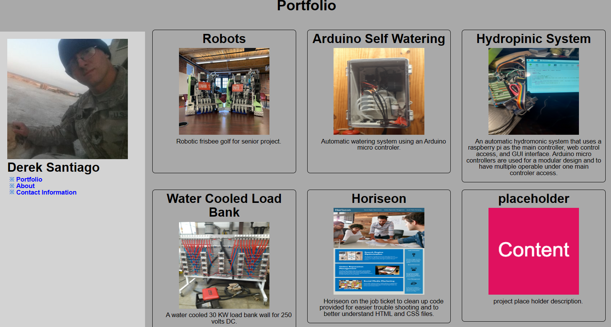

# portfolio
portfolio demistrating personal projects, contact information, and information about me

## About Me
The about me page is on a separate web page and provides a brief description on where i curently work, job title, education and past employment.
Your introduction

## Contact Information
Contact information is on a left navigation column that hides the information links but when hovered over showes clickable links to open the users default email to send an email to me, opens a web page to my GitHub page, or opens a web page to my LinkedIn profile

## Screenshot

## Links

[Portfolio](https://spcsanti1990.github.io/portfolio/)